# Sense Lang

**Sense** is a [VHLL](https://en.wikipedia.org/wiki/Very_high-level_programming_language) (very high level lang.), [FP](https://en.wikipedia.org/wiki/Functional_programming) (functional programming) language that builds a layer of abstraction above the industry standard general purpose programming languages _(like Java, Kotlin, Kotlin, Swift, JS, Python)_ with the purpose to **create software without caring about implementation details.**

> "Programming is a game of information and logic, not of libraries, frameworks and terminology."\
> — <cite>Iliyan Germanov, creator of SenseLang<cite>

_:warning: SenseLang is in ideation phase and everything may change, disappear or be discontinued if there's no point of doing it. Feedback, contributions and support are very welcome! :heavy_check_mark:_
  
## Motivation

Sense purpose is to create software fast and express domain (business) logic by providing only the 100% necessary information and not a single line above that. Meaning that when you're writing Sense you won't care about:
- ~~boilerplate code~~
- ~~complex design patterns~~
- ~~libraries & frameworks~~
- ~~threading~~

> Programming in Sense should be about **thinking** and **expressing** your logic freely in a concise, type-safe and functional way.

**Benefits**
- **Easy to learn:** minimal and simple syntax.
- **Focus only on what matters:** write domain logic and algorithms only.
- **Platform agnostic:** Android, iOS, Web, Desktop, Backend
- **Frameworks/libraries agnostic:** you can target which libs/frameworks you want and the Sense Compiler will generate the code for you.

**Tradeoffs**
- **Performance:** such high-level of abstraction certainly comes with some efficiency costs.
- **:warning: Experimental:** _WIP to be developed._
- **No adoption & community:** if Sense makes sense maybe one day millions of devs would use it.

> Sense Lang: correctness, simplicity, and convenience **over** efficiency, low-level control and implementation details.

**"Sense" name meaning:**
- _"sense"_ like a purpose.
- _"sense"_ like a feeling.
- _"sense"_ like make sense.

## Sense Ideology

Every program is essentially a [domain data](https://en.wikipedia.org/wiki/Domain-driven_design) representation of a problem fed into a [chain of functions](https://en.wikipedia.org/wiki/Function_composition) that transformings input from `A->B->C->N` and producing [side-effects](https://en.wikipedia.org/wiki/Side_effect_(computer_science)) along the way.
  
Sense is designed to easily model any domain into `data`, define your domain logic into `f :: A -> B | C` and handle side-effects (IO, randomness) and `$(state)` gracefully.
  
At the core of Sense is decision-makin, the `CASE`: what to do when case `X` happen and what can happen when you do `Y` operation.
To minimize confusion, we'll assume that every program can be represented by a graph of functions (decisions) and analyze a concrete example.

**Login/Register email example**

```mermaid
graph LR;

emailInput(emailInput)  
validateEmail(validateEmail)  
sendCheckEmailReq(sendCheckEmailReq)  
login(login)
register(register)  
inputPass(inputPass)
validatePass(validatePass)
sendLoginReq(sendLoginReq)
sendRegisterReq(sendRegisterReq)  
  
emailInput -- "email: String" --> validateEmail
validateEmail -- "Valid(email)" --> sendCheckEmailReq
validateEmail -- "Invalid" --> emailInput  
  
sendCheckEmailReq -- "Taken" --> login
sendCheckEmailReq -- "Available" --> register
sendCheckEmailReq -- "HTTPErr" --> emailInput
  
login -- "(Email, LoginPassInput)" --> inputPass
register -- "(Email, RegPassInput)" --> inputPass  

inputPass -- "pass: String, LoginPass | RegPass" --> validatePass
validatePass -- "Invalid, LoginPass | RegPass" --> inputPass
  
validatePass -- "RegisterReq(email, pass)" --> sendRegisterReq
validatePass -- "LoginReq(email, pass)" --> sendLoginReq    
```
  

  
It's a common use-case to do validation, send HTTP requests and based on their response execute different logic.
Here's how this can be implemented in Sense.  
  
  
  
## Sense Syntax

## Try Sesnse

## Contribute

### _WIP: Have feedback? Want to join the project? Please, drop me a line at iliyan.germanov971@gmail.com_  
