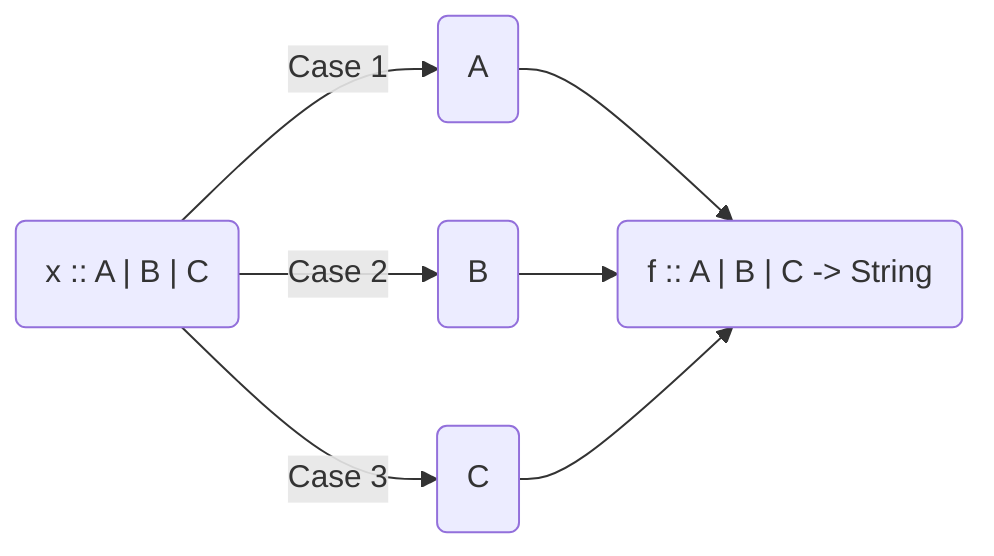

# Sense Lang

**Sense** is a [VHLL](https://en.wikipedia.org/wiki/Very_high-level_programming_language) (very high level lang.), [FP](https://en.wikipedia.org/wiki/Functional_programming) (functional programming) language that builds a layer of abstraction above the industry standard general purpose programming languages _(like Java, Kotlin, Kotlin, Swift, JS, Python)_ with the purpose to **create software without caring about implementation details.**

> "Programming is a game of information and logic, not of libraries, frameworks and terminology."\
> — <cite>Iliyan Germanov, creator of SenseLang<cite>

_:warning: SenseLang is in ideation phase and everything may change, disappear or be discontinued if there's no point of it. Feedback, contributions and support are very welcome! :heavy_check_mark:_
  
## Motivation

Sense purpose is to create software fast and express domain (business) logic by providing only the 100% necessary information and not a single line above that. Meaning that when you're writing Sense you won't care about:
- ~~boilerplate code~~
- ~~complex design patterns~~
- ~~libraries & frameworks~~
- ~~threading~~

> Programming in Sense should be about **thinking** and **expressing** your logic freely in a concise, type-safe and functional way.

**Benefits**
- **Easy to learn:** minimal and simple syntax.
- **Focus only on what matters:** write only what matters - domain logic and algorithms.
- **Platform agnostic:** Android, iOS, Web, Desktop, Backend
- **Frameworks/libraries agnostic:** you can target which libs/frameworks you want and the Sense Compiler will generate the code for you.

**Tradeoffs**
- **Performance:** such high-level of abstraction certainly comes with some efficiency costs.
- **:warning: Experimental:** _WIP to be developed._
- **No adoption & community:** if Sense makes sense maybe one day millions of devs would use it.

> Sense Lang: correctness, simplicity, and convenience **over** efficiency, low-level control and implementation details.

**"Sense" name meaning:**
- _"sense"_ like a purpose.
- _"sense"_ like a feeling.
- _"sense"_ like make sense.

## Sense Ideology

Every program is essentially a [domain data](https://en.wikipedia.org/wiki/Domain-driven_design) representation of a problem fed into a [chain of functions](https://en.wikipedia.org/wiki/Function_composition) that transforms input `A->B->C->N` and produces [side-effects](https://en.wikipedia.org/wiki/Side_effect_(computer_science)) along the way.
  
Sense is designed to easily model any domain into `data`, express your domain logic into functions with cases `f :: A -> B | C`, handle side-effects (IO) and `$(state)` gracefully.
  
## Sense Syntax

If you're not familiar with Haskell and FP, Sense's syntax will not make sense to you at first. So take a deep breath and let's begin with an example.

```
readUserAge :: Int

isAdult :: Int -> Bool
age> age > 18

data WithAlcohol
data NoAlcohol

cocktailType :: Bool -> WithAlcohol | NoAlcohol
adult > if(adult)
  True> WithAlcohol
  False> NoAlcohol

serveCocktail :: WithAlcohol | NoAlcohol -> String
WithAlcohol> "Adults cocktail." 
NoAlcohol> "Kids cocktail."

@Main
cocktailMixer :: Unit
|> readUserAge |> isAdult |> cocktailType
|> serveCocktail |> print
```

### OR types `x: A | B | C`
Meaning that `x` can be of either type `A`, `B` or `C`



### Case-matching `a:A> {code}`

```
f :: A | B | C -> String
a:A> "Case A: " + a
B> "Case B"
C> "Case C"
```


Executes `{code}` with an argument `a` if it matches type `A`. Used to match `|` OR types - something like a weird `if`.

Case Syntax: `argName(optional) : ArgType (optional)> {code}`

#### Example
```
sayNumber :: Int -> String
x> if(x > 10)
  True> if(x == 13)
    True> log("The number is 13!") 
    > "It's 13."
    False> "It's greater than 10 and not 13."
  False> "It's less than 10."
```

### Functions `f :: Input -> Output`

#### Signature
- `functionName :: A, B, C -> T`

`functionName` is a function that accepts `A`, `B` and `C` types and returns `T` as output.

- `version :: String`

`version` is a function that accepts `Unit` (nothing as input) and returns `String`

> Unit = nothing

#### Body
Our first Sense function:
```
helloWorld :: Unit
> print("Hello, world")
```

And a more realistic example:
```
userStatus :: User | Admin -> String
User> "Basic user"
adm: Admin> let level = adm.accessLevel
> if(adm.isActive)
  True> "Active admin, level " + level
  False> "Inactive admin, level " + level
```

> The last line of case in a function always returns a value.


#### Calling functions

To invoke a function simply `f(arg1, arg2, ... , argN)`.

#### Function Composition `|>`
```
f :: A -> B
g :: B -> C
h :: C -> D

comp :: A -> C
|> f |> g |> h
// equivalent to a> f(a) |> g |> h
```

The `|>` operator feeds a value from the left side to a function on the rigth side.

### Variables

#### Immutable `let`
- Declare: `let varName: VarType = value`.
- Read, just: `varName`

#### Mutable `state`
- Declare: `state x: X =  initalValue`.
- Read, just: `x`
- Update: `x = newValue`.

#### Global state & variables
```
let step = 10
state counter = 0

$(step, counter) // gives access to "step" and "counter"
stepUp :: Int
> counter += step
> counter
```

### Primitives
- `Int`: integer (long size).
- `Decimal`: double precision.
- `String`: just a string.
- `Unit`: nothing.

### Primitive modifiers

#### `T?`: optional
Optional value of type `T`. You can case-match via:
```
doubleOrZero :: Int? -> Int
x> x * 2 // non-null optional
null> 0 // optional is null
```

#### Tupple `(A, B)`
Self-explanatory will document later.

#### Array `[T]`
Self-explanatory will document later.

### Data types data
```
data BasicRole
data AdminRole

data User(
  firstName: String
  lastName: String?
  role: BasicRole | AdminRole
  friends: [User]
  monthYear: (Int, Int)
  height: Decimal
)
```
  
> All data fields in Sense are **immutable**.  

### Sense Std Library
Everything else like `Bool`, `for`, `Map`, `Stack`, `Graph`, `map`, `filter`, `DateTime`, etc is included with the standard library.

## Sense Demo

At the core of Sense is decision-makig, the "case-matching": what to do when case `X` happen and what can happen when you do `Y` operation.


To minimize confusion, we'll assume that every program can be represented by a **graph of functions (decisions)** and analyze a concrete example.

**Login/Register email example**

```mermaid
graph LR;

emailInput(inputEmail)  
validateEmail(validateEmail)  
sendCheckEmailReq(sendCheckEmailReq)  
login(login)
register(register)  
inputPass(inputPass)
validatePass(validatePass)
sendLoginReq(sendLoginReq)
sendRegisterReq(sendRegisterReq)  
  
emailInput -- "email: String" --> validateEmail
validateEmail -- "Valid(email)" --> sendCheckEmailReq
validateEmail -- "Invalid" --> emailInput  
  
sendCheckEmailReq -- "Taken(email)" --> login
sendCheckEmailReq -- "Available(email)" --> register
sendCheckEmailReq -- "HTTPErr" --> emailInput
  
login -- "LoginPass(email)" --> inputPass
register -- "RegPass(email)" --> inputPass  

inputPass -- "pass: String, LoginPass | RegPass" --> validatePass
validatePass -- "Invalid, LoginPass | RegPass" --> inputPass
  
validatePass -- "RegisterReq(email, pass)" --> sendRegisterReq
validatePass -- "LoginReq(email, pass)" --> sendLoginReq    
```
  

  
It's a common use-case to do validation, send HTTP requests and based on their response execute different logic.
Here's how this can be implemented in Sense.  

**SmartAuthenticate.sense**  
```sense
inputEmail :: String
> inputField("email")  

data ValidEmail(
 email: String
)
data Invalid  
  
validateEmail :: String -> ValidEmail | Invalid
// pseudo validation  
email> if(contains('@', email) && length(email) > 3)
  True> ValidEmail(email)
  False> Invalid

data Taken(
  email: String
)
data Available(
  email: String
)
  
sendCheckEmailReq :: ValidEmail -> Taken | Available | HttpErr 
valid> send("/checkEmail", valid)
  response: Ok> if(response.body == "taken")
    True> Taken(email)
    False> Available(email)
    // HttpErr> case can be skipped
 
data LoginUI
data RegisterUI
data None  
data UIState(
  state: LoginUI | RegisterUI | None
)

state uiState = UIState(None)  
 
data LoginPass(
  email: String
)
data RegPass(
  email: String
)  
  
$(uiState)  
login :: Taken -> LoginPass 
taken> uiState = LoginUI // modify state
> LoginPass(taken.email)
  
$(uiState)
register :: Available -> RegPass
avail> uiState = RegisterUI
> RegPass(avail.email)

inputPass :: LoginPass | RegPass -> (String, LoginPass | RegPass)
login: LoginPass> (inputField("login_pass"), login)
reg: RegPass> (inputField("reg_pass"), reg)  

data RegisterReq(
  email: String
  pass: String
)
data LoginReq(
  email: String
  pass: String
)  
  
validatePass :: String, LoginPass | RegPass -> LoginReq | RegisterReq | Invalid
pass, type> if(length(pass) > 6)
  True> type // valid password
    LoginPass> LoginReq(email=type.email, pass=pass)
    ReqPass> RegisterReq(email=type.email, pass=pass)
  False> Invalid

@Main  
program :: LoginReq | RegisterReq
|> inputEmail |> validateEmail
  Valid|> sendCheckEmailReq
    Taken|> login |> passFlow
    Available|> register |> passFlow
    HttpError> program() // restart
  Invalid> program() // restart
  
passFlow :: LoginPass | RegPass -> LoginReq | RegisterReq
|> inputPass |> validatePass
  Invalid> passFlow() // repeat flow
``` 

## Try Sesnse

Will host simple Sense playground when the Sense Compiler is ready.

## Contribute

Does SenseLang make sense to you?
Help us make it better:
- give feedback
- contribute
- join the team
- help us find funding

### _WIP: Have feedback? Want to join the project? Please, drop me a line at `iliyan.germanov971@gmail.com`._  
